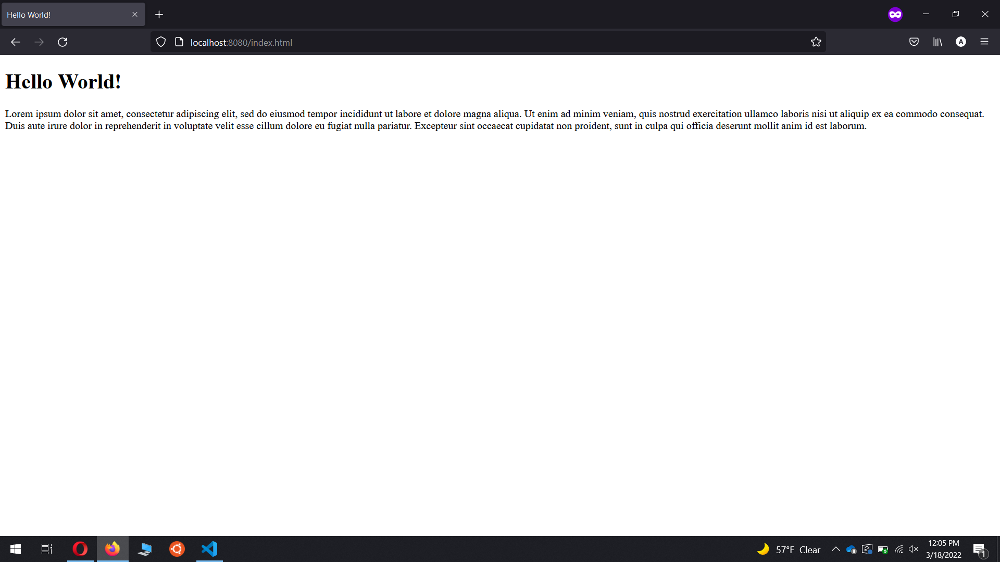
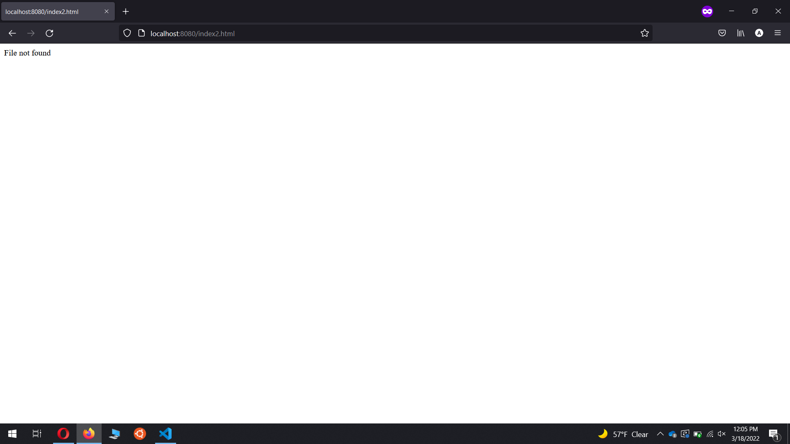

# csci-4760-project2
## Python Web Server

Run `server.py` to start the server.

Default port:ip is `127.0.0.1:8080`

`index.html` is included for demonstration.

Go to https://localhost:8080/index.html or https://127.0.0.1:8080/index.html to see the page.
***
## Success Screenshot

***
## 404 Screenshot

